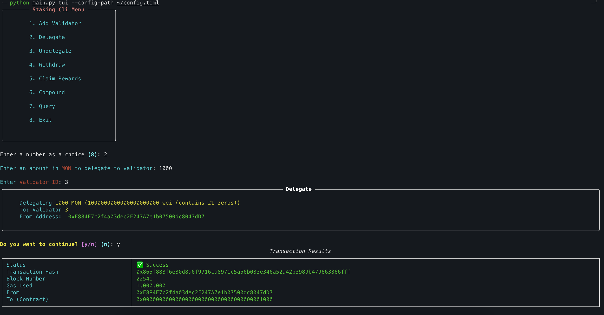
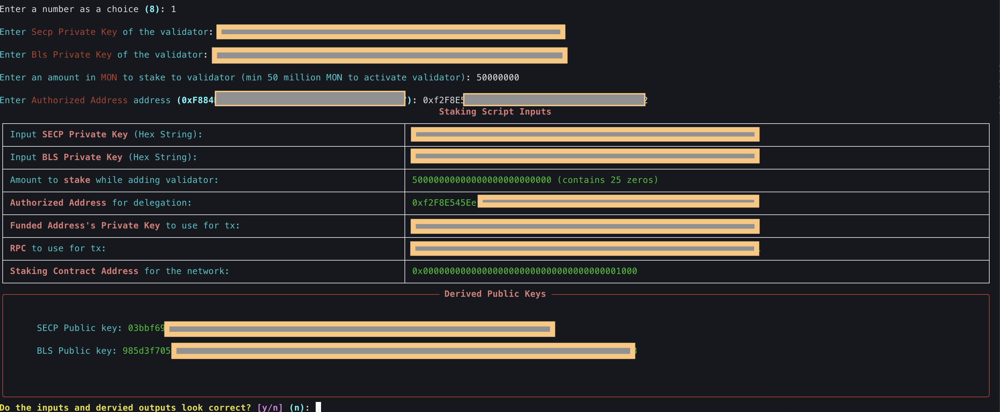

# staking-cli
A CLI tool to interact with Monad's staking contract and execute operations by interacting with it.

## Features
- Adding/Registering a Validator
- Delegating stake to a Validator
- Undelegating stake from a Validator
- Withdrawing pending undelegations using withdrawal IDs
- Claiming rewards
- Compounding rewards
- Querying staking state on the chain

## Prerequisites
- Python 3.8 or higher
- Git
- Access to a Monad RPC endpoint
- Private key with sufficient funds for transactions

## Installation

### 1. Clone the Repository
```sh
git clone https://github.com/monad-developers/staking-sdk-cli.git
cd staking-sdk-cli
```

### 2. Create a virtual environment and activate it
```sh
python -m venv cli-venv
source cli-venv/bin/activate  # On Windows: staking-cli\Scripts\activate
```

### 3. Install project dependencies
```sh
pip install .
```
> Note: To make changes to SDK code and have it reflect, use the `-e` flag with `pip`.

## Configuration Setup

### 1. Create config.toml file
Create a file named `config.toml` in your preferred location (e.g., home directory or project root):

```toml
# Main application settings
title = "staking_cli"
rpc_url = "https://your-monad-rpc-endpoint.com"
chain_id = 30143
contract_address = "0x0000000000000000000000000000000000001000"
# Log levels: debug, info, warning, error
log_level = "info"

[staking]
# IMPORTANT: Replace with your actual private key (without 0x prefix)
funded_address_private_key = "0xYOUR_PRIVATE_KEY_HERE"

[colors]
border = "white"
main = "red"
primary_text = "cyan"
secondary_text = "green"
highlight = "yellow"
```

### 2. Security Notes
- **Never commit your private key to version control**
- **Keep your config.toml file secure and private**
- **Use a funded address with sufficient balance for gas fees**

## Usage

### Navigate to CLI directory
```sh
cd staking-sdk-cli/staking-cli
```

## Command Reference

### Add Validator
Register a new validator on the network.

**Requirements:**
- Minimum stake to join register validator: 1,000,000 MON
- Valid SECP256k1 private key (64 hex chars, no 0x prefix)
- Valid BLS private key (64 hex chars, with 0x prefix)

```sh
python main.py add-validator \
--secp-privkey a1b2c3d4e5f6789... \
--bls-privkey 0x1a2b3c4d5e6f789... \
--auth-address 0x742d35Cc6621C0532925a3b8D4Ea55664bE1ABC1 \
--amount 1000000 \
--config-path ~/config.toml
```

**Expected Output:**
```sh
INFO     SECP Pubkey: 02a1b2c3d4e5f6789...
INFO     BLS Pubkey: b1a2b3c4d5e6f789...
INFO     Tx status: 1
INFO     Tx hash: 0x1234567890abcdef...
```

### Delegate
Delegate MON tokens to a validator.

```sh
python main.py delegate \
--validator-id 1 \
--amount 1000 \
--config-path ~/config.toml
```

**Expected Output:**
```sh
INFO     Tx status: 1
INFO     Tx hash: 0xabcdef1234567890...
```

### Undelegate
Create a withdrawal request to undelegate tokens.

```sh
python main.py undelegate \
--validator-id 1 \
--withdrawal-id 0 \
--amount 500 \
--config-path ~/config.toml
```

### Withdraw
Withdraw tokens from a completed undelegation request.

```sh
python main.py withdraw \
--validator-id 1 \
--withdrawal-id 0 \
--config-path ~/config.toml
```

**Note:** Withdrawals can only be processed after the required waiting period (typically 2 epochs).

### Claim Rewards
Claim accumulated staking rewards.

```sh
python main.py claim-rewards \
--validator-id 1 \
--config-path ~/config.toml
```

### Compound Rewards
Automatically restake rewards as additional delegation.

```sh
python main.py compound-rewards \
--validator-id 1 \
--config-path ~/config.toml
```

## Query Commands

### Query Validator Information
```sh
python main.py query validator --validator-id 1 --config-path ~/config.toml
```

### Query Delegator Information
```sh
python main.py query delegator \
--validator-id 1 \
--delegator-address 0x742d35Cc6621C0532925a3b8D4Ea55664bE1ABC1 \
--config-path ~/config.toml
```

### Query Withdrawal Request
```sh
python main.py query withdrawal-request \
--validator-id 1 \
--delegator-address 0x742d35Cc6621C0532925a3b8D4Ea55664bE1ABC1 \
--withdrawal-id 0 \
--config-path ~/config.toml
```

### Query Validator Set
```sh
# Options: consensus, execution, snapshot
python main.py query validator-set --type consensus --config-path ~/config.toml
```

### Query Delegators for a Validator
```sh
python main.py query delegators --validator-id 1 --config-path ~/config.toml
```

### Query Validators for a Delegator
```sh
python main.py query delegations \
--delegator-address 0x742d35Cc6621C0532925a3b8D4Ea55664bE1ABC1 \
--config-path ~/config.toml
```

### Query Epoch Information
```sh
python main.py query epoch --config-path ~/config.toml
```

### Get Help for Any Command
```sh
python main.py add-validator --help
python main.py delegate --help
# etc.
```

## TUI Mode
Interactive Terminal User Interface mode for easier navigation.

```sh
python main.py tui --config-path ~/config.toml
```

## Important Notes

### Amount Units
- All amounts are specified in **MON units** (not wei)
- Example: `--amount 1000` = 1,000 MON tokens
- The CLI automatically converts MON to wei for blockchain transactions

### Key Formats
- **SECP Private Key**: 64 hexadecimal characters, no `0x` prefix
  - Example: `a1b2c3d4e5f67890123456789abcdef0123456789abcdef0123456789abcdef`
- **BLS Private Key**: 64 hexadecimal characters, with `0x` prefix
  - Example: `0x1a2b3c4d5e6f7890123456789abcdef0123456789abcdef0123456789abcdef`

### Gas Requirements
- Validator registration: ~2M gas
- Delegation operations: ~1M gas
- The CLI automatically sets appropriate gas limits

## Troubleshooting

### Transaction Failures
If transactions fail with status `0`:
1. **Check gas limits**: Validator registration requires higher gas
2. **Verify amounts**: Ensure minimum requirements are met
3. **Check network**: Confirm RPC endpoint is accessible
4. **Validate keys**: Ensure proper key formats

### Common Errors
- **"Invalid Validator ID"**: Use `query validator-set` to see available validators
- **"Cannot withdraw yet"**: Wait for the required epoch delay
- **"Insufficient funds"**: Ensure your address has enough MON for the operation
- **"Key validation failed"**: Check key format and length

### Network Issues
- Verify your RPC URL is correct and accessible
- Check if the network is experiencing downtime
- Ensure your internet connection is stable

## Example Workflow

1. **Setup**: Create `config.toml` with your details
2. **Query**: Check current validator set and epoch
3. **Delegate**: Start with a small delegation to test
4. **Monitor**: Query your delegation status
5. **Manage**: Claim rewards, compound, or undelegate as needed

## TUI workflow Screenshots


## Validator Onboarding Workflow
### Summary:
> ⚠️ Use `monad-keystore` to extract private keys and **verify** the derived keys with their respective public keys! ⚠️

> 🛑 CAUTION: don't commit your `config.toml` file accidently! 🛑
1. Setup staking cli according to the [installation instructions](#installation).
2. Create a `config.toml` file for the staking cli. Refer to `config.toml` [example](#configuration-setup).
3. Get a Funded Address and populate the `config.toml` with it's private key.
4. Make sure you have enough tokens in your wallet - **minimum stake: 1,000,000 MON** to register and **sufficient gas** to execute the transactions.
5. Choose between [cli](#cli-workflow) or [tui](#tui-workflow) mode and execute the `add-validator` workflow as described below.
6. Follow the debug and troubleshooting steps below in case of unexpected behaviour or general issues.

  ### Extract Private keys
  > ⚠️ Due to changes in keystore versions over upgrades make sure you follow the method below to get your private keys!

  - Extract your keystores using the `monad-keystore` binary (v0.11.2) and use the keystore files at `/home/monad/monad-bft/config/id-{bls,secp}` for the commands.
   ```sh
  source /home/monad/.env
  monad keystore --keystore-path /home/monad/monad-bft/config/id-secp --password "$KEYSTORE_PASSWORD" --key-type secp
  ```
  ```sh
  source /home/monad/.env
  monad keystore --keystore-path /home/monad/monad-bft/config/id-bls --password "$KEYSTORE_PASSWORD" --key-type bls
  ```

  ### CLI workflow:
  - Use the command below and **fill in the values carefully** before executing the command, if the keys are wrong the funds will be deducted!
```sh
python main.py add-validator \
--secp-privkey "{{ SECP privkey from id-secp }}" \
--bls-privkey "{{ BLS privkey from id-bls }}" \
--auth-address "{{ auth-address }}" \
--amount 1_000_000 \
--config-path ~/config.toml
```
> Authorized address is the address that will have control over validator operations on-chain. This address can be different from the funded address. Make sure you have control over the authorized address which you provide.
- ⚠️ Make sure you verify keys before entering yes in the prompt
#### Expected Output:
```sh
[13:49:49] INFO     SECP Pubkey: 03bbf692002bda53050f22289d4da8fe0bec8b81a6b0d4f641760....
           INFO     BLS Pubkey: 985d3f7052ac5ad586592ba1a240b0260b5351a9c3973a471fff79....
 Do the dervied public keys match? (make sure that the private keys were recovered using monad-keystore)  [y/n] (n): y
[13:49:52] INFO     Tx status: 1
           INFO     Tx hash: e11114c8e6dd1dc5e0cde400ce5014dab257....
```
> Transaction status: 0 means the transaction failed, check debug steps to get the trace.

### TUI workflow
- Run the staking cli in tui-mode:
```sh
python main.py tui --config-path /path/to/config.toml
```
- In the `Main Menu` choose option 1 to Add Validator


- Fill in the prompts with the appropriate values



- Verify all the values before executing the transaction


### Verification of onboarding
- Make sure the transaction exited with status 1

- Make sure you got a vaildator-id after command runs
```sh
INFO     Validator Created! ID: 1, Delegator: 0xF88.....
```

- Make sure you are part of the execution set (Only after 50 million stake has been given)
```sh
python main.py query validator-set --type execution --config-path ~/config.toml | grep {{ SECP PUBKEY }}
```

- Check validator information. After running above command you will get the validator-id of your validator
```sh
19: 03bbf6...
```
> 19 is the validator id in this case, it can be used to perform other operations like delegate, undelegate, claim, compound etc.

- Fetch validator info
```sh
python main.py query validator --validator-id 1 --config-path ~/config.toml
```
- Verify all values match in the output

### Troubleshooting:
1. Check transaction status, if 0 the transaction has failed
2. For a failed transaction you need to obtain the trace by:
- Getting the tx data:
```sh
curl --location 'https://your-monad-rpc-url' \
--header 'Content-Type: application/json' \
--data '{
	"jsonrpc":"2.0",
	"method":"eth_getTransactionByHash",
	"params":[
		"0xe57ada....{enter the hash of the failed tx}..."
	],
	"id":1
}'
```
- Use the data from the above tx to make an `eth_call` tx:
```sh
curl --location 'https://your-monad-rpc-url' \
--header 'Content-Type: application/json' \
--data '{
	"jsonrpc":"2.0",
	"method":"eth_call",
	"params":[{
		"from": "0xf88c... {{ FILL FROM TX DATA }}",
		"to": "0x0000000000000000000000000000000000001000 {{ FILL FROM TX DATA }}",
		"gas": "0xc350",
		"gasPrice": "0xbdfd63e00",
		"value": "{{ FILL FROM TX DATA }}",
		"data": "0xf145204c0000000000l {{ FILL FROM TX DATA }}.... "
	}, "latest"],
	"id":1
}'
```

The above would give you the trace response like:
```json
{
    "jsonrpc": "2.0",
    "error": {
        "code": -32603,
        "message": "insufficient balance"
    },
    "id": 1
}
```

- In the case you can't debug from the trace, post it on discord or open a ticket.
