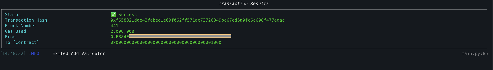

# Validator Onboarding Workflow

### Summary

1. Setup staking cli according to the [installation instructions](../readme.md#installation).
2. Get a Funded Address and populate the `config.toml` with its private key.
   For better security, export `FUNDED_ADDRESS_PRIVATE_KEY` as an env var, or even better, use a Ledger hardware wallet and adjust `config.toml` accordingly.
   - **Please use hardware wallet for production environment**
   - **Don't commit your `config.toml` file accidently**
3. Make sure the wallet is funded with enough balance
   - **minimum stake: 100,000 MON** to register
   - **sufficient gas** to execute the transactions
4. Choose between [cli](#cli-workflow) or [tui](#tui-workflow) mode and execute the `add-validator` workflow as described below.
5. Follow the debug and troubleshooting steps below in case of unexpected behaviour or general issues.

### Extract Private keys

⚠️ **DO NOT USE ANY KEYS IN BACKUP FILES**: Due to changes in keystore versions over upgrades make sure you follow the method below to get your private keys.
Use `monad-keystore` to extract private keys and **verify** the derived keys with their respective public keys!

1. Extract your SECP and BLS keys from keystores using the `monad-keystore` binary and the keystore files.

```sh
source /home/monad/.env
monad-keystore recover --password "$KEYSTORE_PASSWORD" --keystore-path /home/monad/monad-bft/config/id-secp  --key-type secp
monad-keystore recover --password "$KEYSTORE_PASSWORD" --keystore-path /home/monad/monad-bft/config/id-bls  --key-type bls
```

### CLI workflow

1. Use the command below and **fill in the values carefully** before executing the command, if the keys are wrong the funds will be deducted! Replace the variable with actual values.

```sh
python staking-cli/main.py add-validator \
  --secp-privkey "${SECP_PRIVATE_KEY}" \
  --bls-privkey "${BLS_PRIVATE_KEY}" \
  --auth-address "${AUTH_ADDRESS}" \
  --amount 100_000
```

Authorized address is the address that will have control over validator operations on-chain. This address can be different from the funded address.
Make sure you have control over the authorized address you provided.

2. ⚠️**Verify the public keys are matching** before entering `yes` to continue: If wrong addresses are used, the validator keys will need to rotate and reconfigured.

```sh
[13:49:49] INFO     SECP Pubkey: 03bbf692002bda53050f22289d4da8fe0bec8b81a6b0d4f641760....
           INFO     BLS Pubkey: 985d3f7052ac5ad586592ba1a240b0260b5351a9c3973a471fff79....
 Do the derived public keys match? (make sure that the private keys were recovered using monad-keystore)  [y/n] (n): y
[13:49:52] INFO     Tx status: 1
           INFO     Tx hash: e11114c8e6dd1dc5e0cde400ce5014dab257....
```

`Transaction status: 0` means the transaction failed, check debug steps to get the trace.

### TUI workflow

1. Run the staking cli in tui-mode:

```sh
python staking-cli/main.py tui
```

2. In the `Main Menu` choose option 1 to Add Validator


3. Fill in the prompts with the appropriate values


4. Verify all the values before executing the transaction



### Verification of onboarding

1. Make sure the transaction exited with status 1
2. Make sure you got a validator-id after command runs

```sh
INFO     Validator Created! ID: 1, Delegator: 0xF88.....
```

3. Make sure you are part of the execution set

```sh
python main.py query validator-set --type execution --config-path ~/config.toml | grep {{ SECP PUBKEY }}
```

4. Check validator information. After running above command you will get the validator-id of your validator

```sh
19: 03bbf6...
```

In this case, `19` is the validator id, it can be used to perform other operations like delegate, undelegate, claim, compound, etc.

5. Fetch validator info

```sh
python main.py query validator --validator-id 1 --config-path ~/config.toml
```

6. Verify all values match in the output

### Troubleshooting

Check transaction status, if 0 the transaction has failed.

For a failed transaction you need to obtain the trace by:

- Getting the tx data:

```sh
curl --location 'https://your-monad-rpc-url' \
--header 'Content-Type: application/json' \
--data '{
 "jsonrpc":"2.0",
 "method":"eth_getTransactionByHash",
 "params":[
  "0xe57ada....{enter the hash of the failed tx}..."
 ],
 "id":1
}'
```

- Use the data from the above tx to make an `eth_call` tx:

```sh
curl --location 'https://your-monad-rpc-url' \
     --header 'Content-Type: application/json' \
     --data '{
     "jsonrpc":"2.0",
     "method":"eth_call",
     "params":[{
       "from": "0xf88c... {{ FILL FROM TX DATA }}",
       "to": "0x0000000000000000000000000000000000001000 {{ FILL FROM TX DATA }}",
       "gas": "0xc350",
       "gasPrice": "0xbdfd63e00",
       "value": "{{ FILL FROM TX DATA }}",
       "data": "0xf145204c0000000000 {{ FILL FROM TX DATA }}.... "
     }, "latest"],
     "id":1
     }'
```

The above would give you the trace response like:

```json
{
  "jsonrpc": "2.0",
  "error": {
    "code": -32603,
    "message": "insufficient balance"
  },
  "id": 1
}
```

In the case you can't debug from the trace, post it on discord or open a ticket.
